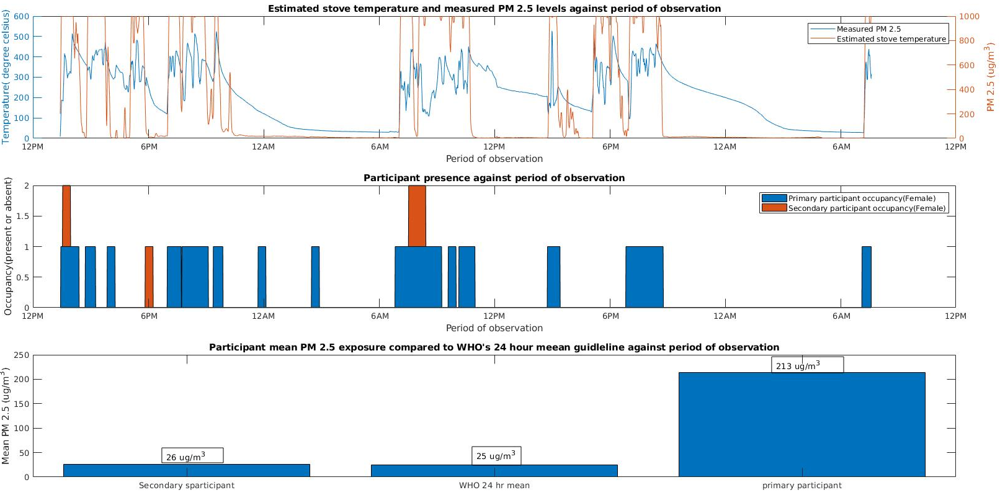
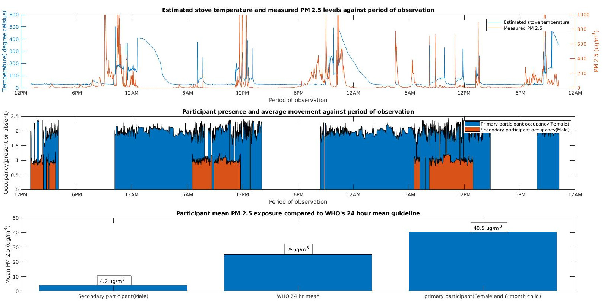
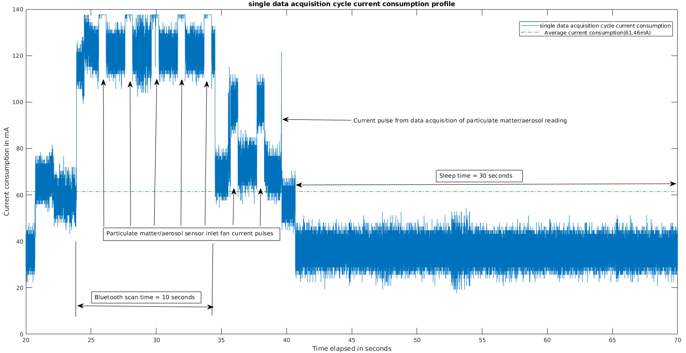
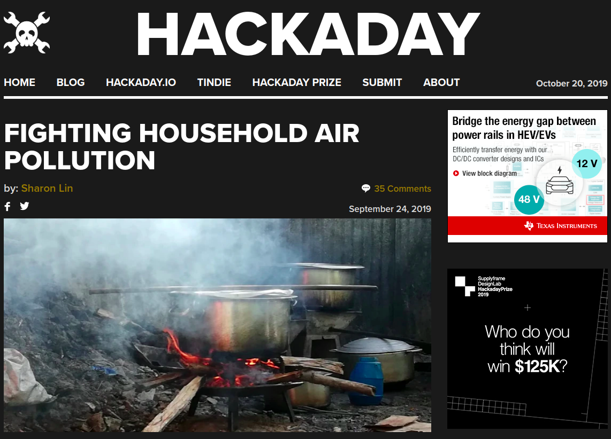

# OpenHAP
A low cost, opensource research tool with remote measurement capability for non invasive, stationary monitoring of household air pollution.

---

General parameters monitored include: 

* **Household air pollution.**

* **Stove temperatures and stove stacking.**

* **Associated human behavioral patterns.**

OpenHAP is designed as a modular software/firmware layer that supports customizable measurement hardware. It utilises open datalogging file formats such as:

* **.csv** for timestamped measurement data.

* [**.npy**](https://numpy.org/devdocs/reference/generated/numpy.lib.format.html) numpy files for timestamped 2D thermal images for post analysis(2.8 KiB size per thermal snapshot).

allowing easy data analysis in python, matlab and R while allowing you extend the software and build new hardware components to suit your measurement needs.

# Sample results

Measurement results for rural Kiambu, Kenya. Household energy use - Three Stone Open Fire(TSOF)

Measurement results for urban Kibera, Kenya. Household energy use - Kerosene and charcoal briquettes.

# OpenHAP's power consumption

Power consumption of an OpenHAP unit. Various measurement parameters can be seen to affect battery life.

# Documentation
OpenHAP's story is covered in [this hackaday article](https://hackaday.com/2019/09/24/fighting-household-air-pollution/) with indepth technical documentation at [this link](https://hackaday.io/project/166510-openhap)

