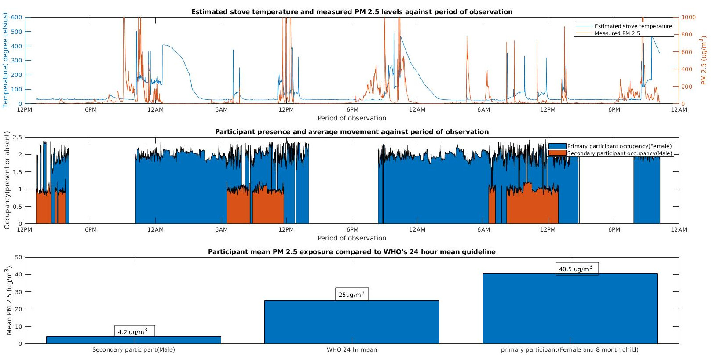

# OpenHAP
A low cost, opensource research tool with remote measurement capability for non invasive, stationary monitoring of:

* **Household air pollution.**

* **Stove temperatures and stove stacking.**

* **Associated human behavioral patterns.**

OpenHAP is designed as a modular software/firmware layer with ANSI C compatibility. It utilises open datalogging file formats such as: 

* **.csv** for timestamped measurement data.

* **.npy** numpy files for timestamped 2D thermal images for post analysis(2.8 kilobytes per image)

allowing easy data analysis in python, matlab and R while allowing you extend the software and build new hardware components to suit your measurement needs. 

# Sample results

# Documentation
OpenHAP's story is covered in [this hackaday article](https://hackaday.com/2019/09/24/fighting-household-air-pollution/) with indepth technical documentation at [this link](https://hackaday.io/project/166510-openhap)

