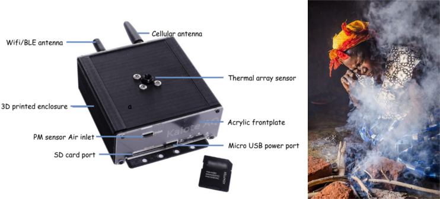

# OpenHAP
A low cost, opensource research tool with remote measurement capability for non invasive, stationary monitoring of household air pollution.

---

General parameters monitored include: 

* **Household air pollution** using either PM 1/2.5/10 as pollution indicators.

* **Stove temperatures** in order to attribute pollution measurements above to stove characteristics while in use to answer questions such as - What phase of stove use is pollution highest for a given stove type?

* **Associated human behavioral patterns.** The device infers this by processing signal strength statistics of wireless signals(RSSI) from a non invasive bluetooth wrist strap worn by the members of the household being monitored.

OpenHAP is designed as a modular software/firmware layer that supports customizable measurement hardware. It utilises open datalogging file formats such as:

* **.csv** for timestamped measurement data.

Figure: Sample 2D thermal image(32x24 pixels) of a human being during testing. Temperature is shown on the Z axis on the GIF. Thermal images are used to correlate stove temperature to Particulate measurements. Stove temperature can be well inferred from our tests if the stove is within the sensor's field of view. See graphical plots below from two households chosen from Kibera and rural Kenya(Kiambu).

# Sample results

Measurement results for a rural low income household,Kiambu Kenya with two middle aged women. Household energy use - Three Stone Open Fire(TSOF)

Measurement results for an urban low income household,Kibera Kenya occupied by a man, wife and 2 children. Children were not monitored in our study as majority of their time was spent with the mother. Household energy use - Kerosene and charcoal briquettes.

# Documentation
OpenHAP's story is covered in [this hackaday article](https://hackaday.com/2019/09/24/fighting-household-air-pollution/) with indepth technical documentation at [this link](https://hackaday.io/project/166510-openhap)

